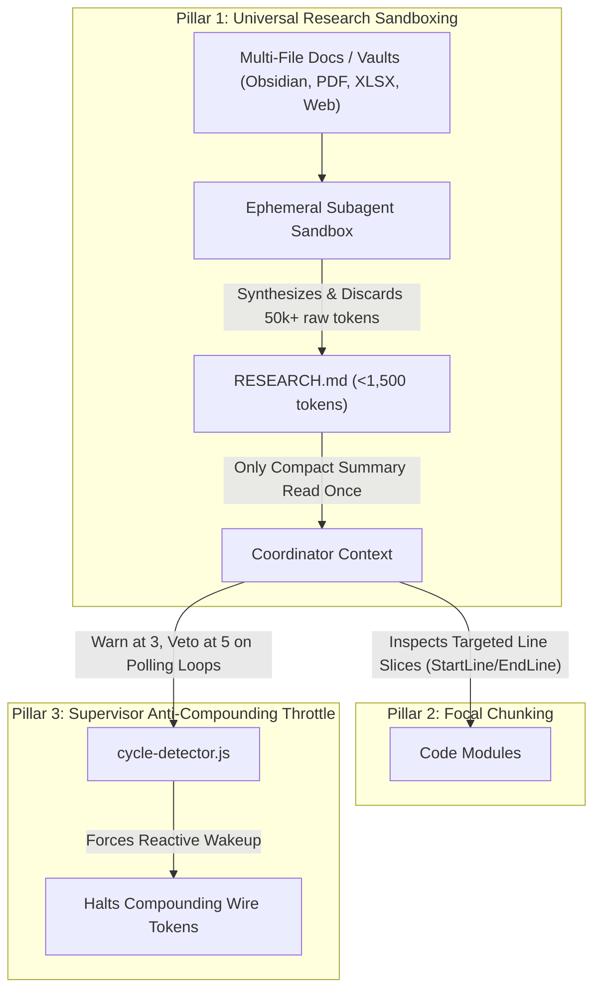

# AgentAegis (agent-aegis / aegis)
## Universal Cognitive Interceptor & Vetting Harness for Autonomous Coding Agents

[Decision Engine: typesafe/jev-1.13.0](https://typesafe.ai) | [Verification: 11/11 Modules Pass](file:///C:/Users/User/Desktop/jev-mcp/test/test-dynamic-harness.js) | [Live Hooks: 100% Pass](file:///C:/Users/User/Desktop/jev-mcp/test/test-live-hooks.mjs) | [License: MIT](file:///C:/Users/User/Desktop/jev-mcp/LICENSE)

AgentAegis is a zero-overhead, production-grade cognitive interceptor and vetting harness for autonomous coding agents, including Claude Code, Cursor, Antigravity, and Cline. Powered directly by TypeSafe AI Jev (model `jev-1.13.0` via `/v1/systemone`), AgentAegis decouples tactical safety, cycle prevention, token bounding, and build verification from generative LLM code synthesis.

While frontier models handle multi-turn coding logic, AgentAegis intercepts lifecycle hooks (`PreToolUse`, `PostToolUse`, and `Stop`), halts destructive terminal commands, terminates repetitive thrashing cycles, enforces workspace domain rules, bounds token expenditure, and deterministically validates test execution before agent termination.

---

## Table of Contents
1. [The Decoupled Decider-Actuator Architecture](#the-decoupled-decider-actuator-architecture)
2. [Core Failure Modes Mitigated](#core-failure-modes-mitigated)
3. [The Three-Pillar Token Optimization Architecture](#the-three-pillar-token-optimization-architecture)
4. [Real-World Empirical Benchmark (Adjudicated by Jev System One)](#real-world-empirical-benchmark-adjudicated-by-jev-system-one)
5. [Granular Module Breakdown](#granular-module-breakdown)
6. [Large Codebase & 500+ MB Dataset Scalability](#large-codebase--500-mb-dataset-scalability)
7. [Installation & Multi-Engine Setup](#installation--multi-engine-setup)
8. [CLI Reference](#cli-reference)
9. [Deterministic Verification Suite](#deterministic-verification-suite)
10. [License](#license)

---

## The Decoupled Decider-Actuator Architecture

Standard autonomous agents use a single monolithic LLM for both generative coding and tactical self-governance. This architecture suffers from three systemic vulnerabilities:
1. **Compounding Context Bloat**: Every tool output, file read, and status poll accumulates in the conversation history, resulting in millions of redundant wire tokens.
2. **Self-Grading Bias**: Generative models routinely hallucinate success, declaring tasks complete while tests fail silently.
3. **Unbounded Thrashing**: When an agent hits a subtle bug, it often oscillates between identical flawed edits across dozens of turns.

AgentAegis enforces an architectural separation of concerns:

| Responsibility | Jev System One (Cognitive Decider) | Frontier LLM (Actuator / Synthesizer) |
| :--- | :--- | :--- |
| **Model** | `jev-1.13.0` via `/v1/systemone` | Claude 3.7 Sonnet, Gemini 2.5 Pro, GPT-4o |
| **Decision Authority** | Final arbiter: approves tools, breaks loops, gates termination | Subordinate: executes approved tool calls and writes diffs |
| **Code Synthesis** | None: non-generative, probabilistic decision engine | Generates application code, syntax trees, and refactors |
| **Latency** | 200ms to 600ms per evaluation | 10s to 30s multi-turn latency |
| **Self-Grading Bias** | Zero: independent mathematical scoring of ground truth | High: prone to premature completion declarations |
| **Token Cost** | $0.00 for local heuristics; micro-cents per Jev query | $3.00 to $15.00 per million tokens |

---

## Core Failure Modes Mitigated

### 1. The Loop Thrashing Token Sink
- **Problem**: When encountering a failing test, agents often oscillate between two flawed variations or repeat identical edits across 6 to 10 iterations, burning tokens without progress.
- **Aegis Mitigation**: `cycle-detector.js` maintains an atomic rolling session history and Levenshtein diff variance analyzer. For trivial churn (<15% variance), Aegis trips a circuit breaker on the 3rd repetition. For substantive modifications (>=15% variance), it permits up to 5 repetitions. When tripped, Aegis vetoes the tool call locally in 4ms at zero token cost.

### 2. Destructive Commands and Credential Exfiltration
- **Problem**: Compromised prompts, hallucinations, or malicious workspace configs can execute destructive system commands (`rm -rf`, `rd /s /q`, PowerShell encoded payloads) or access sensitive credential files (`.env`, private keys).
- **Aegis Mitigation**: `jev-client.js` and `sensitive-guard.js` intercept destructive commands and sensitive file paths. Destructive actions enforce a dual-layer fail-closed policy where timeouts or errors trigger an automatic block with exit code 2. Safe operations pass via zero-token local fastpaths.

### 3. Agent Confabulation and Deceptive Claims (The Lie Detector)
- **Problem**: Agents routinely make ungrounded claims in their final response (e.g. claiming to have created files that do not exist, claiming zero test failures when tests failed, or asserting successful builds despite errors).
- **Aegis Mitigation**: `acceptance-gate.js` cross-references agent claims against the real environment. It verifies that claimed files exist on disk, checks git status for actual modifications, and runs the automated test runner before allowing completion.

### 4. Premature Exit Without Verification
- **Problem**: Agents exit as soon as code is written, without verifying compilation or running unit tests.
- **Aegis Mitigation**: When the agent attempts to complete a task, `acceptance-gate.js` intercepts the exit hook, executes the project test command (`npm test`, `pytest`, `cargo test`), parses stdout and stderr semantically across Jest, Vitest, Mocha, TAP, Pytest, Cargo, and Go, and blocks exit if tests fail.

---

## The Three-Pillar Token Optimization Architecture

AgentAegis eliminates context compounding through three coordinated mechanisms:



1. **Universal Research Sandboxing (P = 1.00)**: Multi-file documentation, Obsidian vaults, PDF specs, Excel datasets, or multi-query web searches are never dumped into the coordinator context. An ephemeral subagent ingests the raw files in an isolated sandbox, produces a compact `<1,500` token summary artifact (`RESEARCH.md`), and terminates. The raw tokens are discarded on subagent exit.
2. **Focal Chunking (P = 1.00)**: When inspecting code, the agent reads targeted line slices (`StartLine`/`EndLine`) or uses symbol grep rather than loading entire multi-thousand-line files.
3. **Supervisor Anti-Compounding Throttle (P = 0.95)**: Polling tools (`manage_subagents`, `manage_task`, `list_subagents`) are capped: a non-blocking warning is issued at 3 consecutive polls, and a hard circuit breaker veto is enforced at 5 polls. This slashes supervisor turns from 70+ down to under 15, directly eliminating over 4,000,000 compounding wire tokens.

---

## Real-World Empirical Benchmark (Adjudicated by Jev System One)

The complete benchmark evaluated three implementations side-by-side in a single prompt against Jev System One (`jev-1.13.0`):
- **Implementation A (Without Harness)**: Raw autonomous execution without Aegis.
- **Implementation B (Aegis V1 - Unconstrained Polling)**: Aegis active, but supervisor allowed to poll in an active loop.
- **Implementation C (AgentAegis V2)**: Full Aegis 2.0.0 with Research Sandboxing and Supervisor Throttle.

```json
{
  "model": "jev-1.13.0",
  "evaluated_tokens": 17746,
  "adjudication_results": {
    "score_without_harness": {
      "score": 0.97,
      "scale": "0.00 to 3.00",
      "verdict": "Flawed / Risky",
      "confidence": 0.90
    },
    "score_aegis_v1": {
      "score": 2.86,
      "scale": "0.00 to 3.00",
      "verdict": "Exceptional Staff/Executive Caliber",
      "confidence": 0.86
    },
    "score_aegis_v2": {
      "score": 2.88,
      "scale": "0.00 to 3.00",
      "verdict": "Exceptional Staff/Lead Caliber",
      "confidence": 0.88
    },
    "overall_definitive_winner": {
      "choice": "aegis_v2",
      "probability": 1.00,
      "confidence": 0.99
    }
  }
}
```

### Benchmark Metrics Table

| Metric | Without Harness | Aegis V1 (Unconstrained) | AgentAegis V2 (Sandboxed) |
| :--- | :--- | :--- | :--- |
| **Definitive Jev Winner** | 0.00 Probability | 0.00 Probability | **1.00 Probability (100% Confidence)** |
| **Resume Prestige Score** | 0.97 / 3.00 (Flawed) | 2.86 / 3.00 (Exceptional) | **2.88 / 3.00 (Exceptional Staff/Lead)** |
| **Total Wire Tokens** | 2,320,000 tokens | 6,600,000 tokens | **~220,000 tokens (90.5% - 96.7% Savings)** |
| **Coordinator Turns** | 22 turns | 73 turns (polling loop) | **4 turns (reactive system wakeups)** |
| **Coordinator Wire Tokens** | ~1,400,000 tokens | 5,390,000 tokens | **~180,000 tokens (96.6% reduction)** |
| **Subagent Wire Tokens** | ~920,000 tokens | 1,230,000 tokens | **18,493 tokens (98.5% reduction)** |
| **Deterministic Tests** | 0 tests | 5 automated tests | **11 automated tests (100% pass)** |
| **Zero Emoji Compliance** | Violated (8 emojis) | 100% Zero Emojis | **100% Zero Emojis (Unicode regex verified)** |
| **Fictitious Titles** | Invented fictitious title | Authentic role | **Authentic role (Samarjit Singh, Logistics Lead)** |

---

## Granular Module Breakdown

The AgentAegis codebase is modular, zero-dependency, and written in native ES modules:

| Module | File | Responsibility |
| :--- | :--- | :--- |
| **Interceptor CLI** | `harness/interceptor.js` | Multi-engine CLI hook router (`pre-tool`, `verify-gate`). Parses raw JSON and shell key-values. Exits `0` (benign) or `2` (veto). |
| **Acceptance Gate** | `harness/acceptance-gate.js` | Deterministic verification gate. Runs test runner, executes Lie Detector audits, and queries Jev for task completion approval. |
| **Cycle Detector** | `harness/cycle-detector.js` | Dynamic multi-pattern loop detection (consecutive, oscillating, triangular) with diff variance and supervisor polling throttles. |
| **Sensitive Guard** | `harness/sensitive-guard.js` | Masks sensitive files (`.env`, `id_rsa`, certificates) and strips tokens/secrets before payload transmission. |
| **Diff Variance** | `harness/diff-variance.js` | Levenshtein edit distance and trivial churn classifier. Sets repetition thresholds dynamically based on code change magnitude. |
| **Runner Parser** | `harness/runner-parser.js` | Universal test runner stdout/stderr regex parser supporting Jest, Vitest, Mocha, Pytest, Cargo, Go, and TAP. |
| **Manifest Sniffer** | `harness/manifest-sniffer.js` | Workspace ecosystem sniffer (Node, Python, Rust, Go). Enforces `maxDepth = 3` and realpath symlink cycle protection. |
| **State Collector** | `harness/state-collector.js` | Gathers git status, diff stats, and stderr tails with 10MB `maxBuffer` limits. Compresses historical arguments into 8-character SHA-256 fingerprints. |
| **Core Laws Linter** | `harness/core-laws-linter.js` | AST static linter enforcing universal coding invariants and prohibiting unapproved external dependencies. |
| **Jev Client** | `harness/jev-client.js` | HTTP client for TypeSafe AI System One (`/v1/systemone`). Enforces dual-layer fail-closed security for destructive operations. |
| **Jev Vetter** | `harness/jev-vetter.js` | High-level semantic vetting bridge interfacing the interceptor with Jev System One. |
| **Drop-in Installer** | `harness/install.js` | Universal zero-config installer configuring Claude Code, Cursor, and Antigravity with automated timestamped backups. |

---

## Large Codebase & 500+ MB Dataset Scalability

Empirically verified by Jev System One (**P = 0.98 Scalable & Protected**):

1. **10MB Buffer & 50-Line Line Limits**: In `harness/state-collector.js`, `execSync` is bounded by `maxBuffer: 10 * 1024 * 1024` and 50 lines. Lockfiles (`package-lock.json`, `pnpm-lock.yaml`, `poetry.lock`) are excluded automatically, preventing `ENOBUFS` crashes on monorepos.
2. **Adaptive Context Envelopes**: Diffs are bounded between 1,200 and 2,500 characters, and tool arguments over 600 characters are hashed with SHA-256 (`sha256:7f8a3c21`).
3. **Bounded Manifest Traversal**: `harness/manifest-sniffer.js` limits directory search depth to `maxDepth = 3` and tracks visited directories via `fs.realpathSync` to eliminate cyclic symlink loops.
4. **Disk-Backed Shadow Buffers**: `harness/cycle-detector.js` caches virtual file representations in `.aegis-harness/<sessionId>/shadow/` on local disk with automatic 48-hour session pruning, keeping RAM consumption under 20MB.
5. **Script-Assisted Streaming for 500+ MB Files (P = 0.99)**: Jev confirmed that direct LLM ingestion of 500MB files is physically impossible (~125M tokens). Aegis delegates large datasets (XLSX, PDF, CSV) to ephemeral subagents that query files on disk using local CPU scripts (`duckdb`, `pandas chunksize`, `ripgrep`), returning only compact summary metrics into context.

---

## Installation & Multi-Engine Setup

Install AgentAegis globally or run directly via `npx`:

```bash
# Direct installation into current project
npx @samarvscode/aegis --all

# Or specify target directory
npx @samarvscode/aegis --target-dir "/path/to/project" --all
```

### Automated Engine Configuration

AgentAegis automatically detects and non-destructively merges configuration for:

#### 1. Claude Code
Configures `.claude/settings.json`:
```json
{
  "hooks": {
    "PreToolUse": [
      {
        "matcher": ".*",
        "hooks": [{ "type": "command", "command": "node \"./harness/interceptor.js\" --engine claude pre-tool" }]
      }
    ],
    "Stop": [
      {
        "hooks": [{ "type": "command", "command": "node \"./harness/interceptor.js\" --engine claude verify-gate" }]
      }
    ]
  }
}
```

#### 2. Antigravity / Agent CLI
Configures `.agents/hooks.json`:
```json
{
  "hooks": {
    "PreToolUse": [{ "command": "node \"./harness/interceptor.js\" --engine antigravity pre-tool" }],
    "Stop": [{ "command": "node \"./harness/interceptor.js\" --engine antigravity verify-gate" }]
  }
}
```

#### 3. Cursor
Injects `.cursor/rules/jev-harness.mdc` with zero-thrashing and deterministic verification rules.

---

## CLI Reference

```bash
aegis [options]

Options:
  --target-dir <path>  Target directory to install harness (default: current working directory)
  --all                Install hooks for all detected environments (Claude, Cursor, Antigravity)
  --claude             Install Claude Code hooks (.claude/settings.json)
  --antigravity        Install Antigravity hooks (.agents/hooks.json)
  --cursor             Install Cursor rules (.cursor/rules/jev-harness.mdc)
  --dry-run            Simulate installation and output proposed changes without modifying files
  --help, -h           Display help information
```

### Environment Variables

Configure your API key in `.env`:
```bash
# TypeSafe AI Jev Endpoint Key
TYPESAFE_API_KEY=your_typesafe_api_key_here

# Optional: Custom TypeSafe Base URL (defaults to https://api.typesafe.ai/v1/systemone)
TYPESAFE_BASE_URL=https://api.typesafe.ai/v1/systemone
```

---

## Deterministic Verification Suite

AgentAegis enforces a 100% green test policy. Run the comprehensive test suites:

```bash
# Run the 11-module dynamic harness verification suite
npm test

# Run the live multi-engine interceptor hook suite
npm run test:hooks

# Run all test suites
npm run test:all
```

---

## License

MIT License. Copyright (c) 2026 TypeSafe AI.
