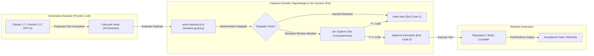
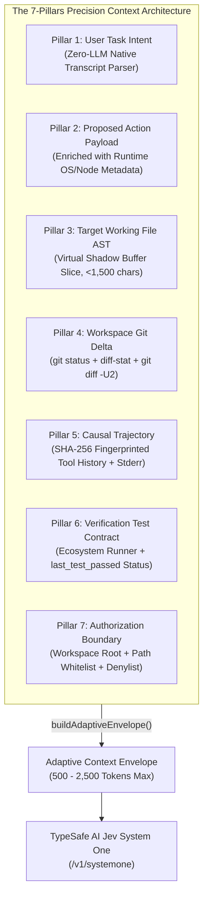
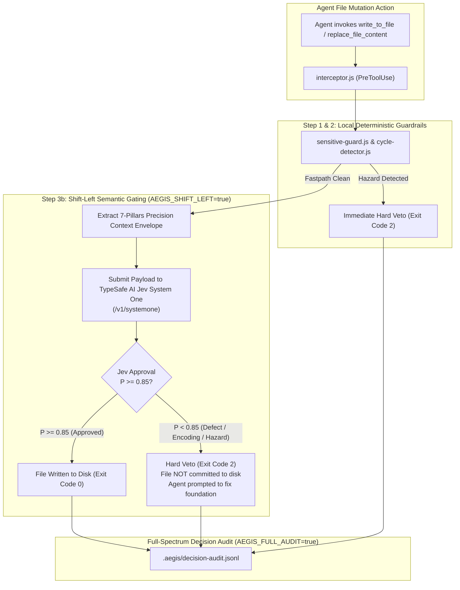
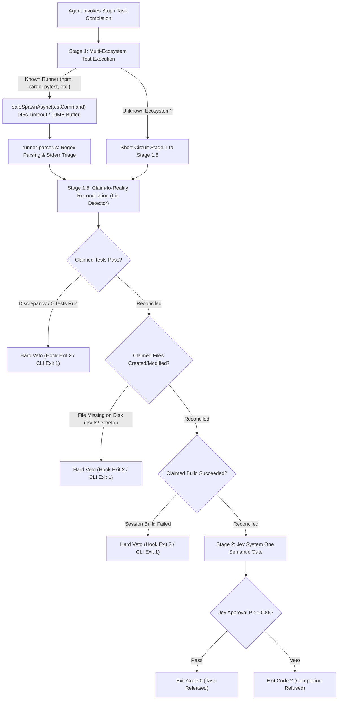
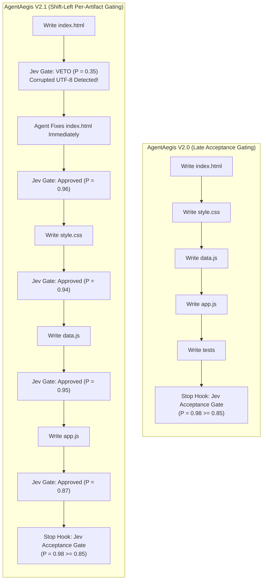
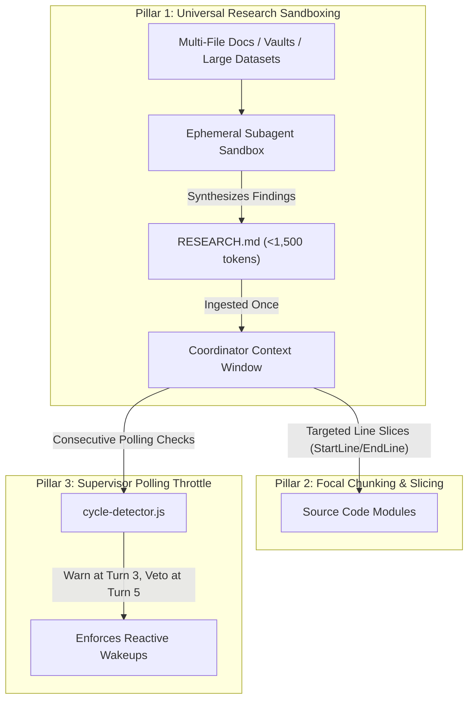

# AgentAegis (`@samarvscode/aegis`)
## Universal Cognitive Interceptor & Vetting Harness for Autonomous Coding Agents

[](package.json)
[](https://typesafe.ai)
[](test/test-dynamic-harness.js)
[](test/test-live-hooks.mjs)
[](EMPIRICAL_AUDIT_REPORT.md)
[](LICENSE)

AgentAegis is an enterprise-grade cognitive interceptor and validation harness for autonomous coding agents operating across Claude Code, Cursor, and Google Antigravity. By attaching directly to runtime lifecycle hooks (`PreToolUse`, `PostToolUse`, and `Stop`), AgentAegis enforces deterministic security controls, loop cycle detection, credential exfiltration prevention, claim-to-disk reconciliation, moment-of-creation artifact vetting, and automated test-suite verification before agent termination.

> [!IMPORTANT]
> **Security Boundaries & Sandboxing Scope**: AgentAegis operates in user-space as an application-level cognitive lifecycle defense-in-depth harness to prevent agent thrashing, cognitive drift, destructive shell errors, and credential exposure. It is **not** an operating-system-level sandbox or kernel hypervisor. Malicious binary containment and untrusted arbitrary process isolation strictly require containerization (Docker, eBPF, seccomp, gVisor, Firecracker microVMs).

By decoupling lifecycle validation from the generative model synthesizing code, the harness executes local deterministic policies and delegates high-stakes semantic decisions to TypeSafe AI Jev (`jev-1.13.0`).

---

## Table of Contents
1. [1. The Decoupled Decider-Actuator Architecture](#1-the-decoupled-decider-actuator-architecture)
2. [2. The 7-Pillars Precision Context Architecture](#2-the-7-pillars-precision-context-architecture)
3. [3. Session Resolution Chain & Isolation](#3-session-resolution-chain--isolation)
4. [4. Shift-Left Per-Artifact Semantic Gating (V2.1)](#4-shift-left-per-artifact-semantic-gating-v21)
5. [5. 3-Stage Acceptance Gate & Ground-Truth Reconciliation](#5-3-stage-acceptance-gate--ground-truth-reconciliation)
6. [6. Deterministic Policy Pre-Gates & Single Gate Authority](#6-deterministic-policy-pre-gates--single-gate-authority)
7. [7. Decision Audit Trail & Telemetry Engine](#7-decision-audit-trail--telemetry-engine)
8. [8. PostToolUse Telemetry & Test State Tracking](#8-posttooluse-telemetry--test-state-tracking)
9. [9. Windows & Cross-Platform Subprocess Execution](#9-windows--cross-platform-subprocess-execution)
10. [10. Security Scope & Cognitive Defense-in-Depth](#10-security-scope--cognitive-defense-in-depth)
11. [11. Bipartite Fail-Safe & Network Outage Matrix](#11-bipartite-fail-safe--network-outage-matrix)
12. [12. Independent Architecture Review & Jev Adjudication Report](#12-independent-architecture-review--jev-adjudication-report)
13. [13. Empirical Jev System One Benchmark Metrics](#13-empirical-jev-system-one-benchmark-metrics)
14. [14. Empirical Multi-Turn Benchmark: V2.0 vs V2.1 Case Study](#14-empirical-multi-turn-benchmark-v20-vs-v21-case-study)
15. [15. The Three-Pillar Token Optimization Architecture](#15-the-three-pillar-token-optimization-architecture)
16. [16. Granular Module Breakdown](#16-granular-module-breakdown)
17. [17. Large Codebase & 500+ MB Dataset Scalability](#17-large-codebase--500-mb-dataset-scalability)
18. [18. Installation & Multi-Engine Setup](#18-installation--multi-engine-setup)
19. [19. CLI Reference](#19-cli-reference)
20. [20. Deterministic Verification Suite](#20-deterministic-verification-suite)
21. [21. License](#21-license)

---

## 1. The Decoupled Decider-Actuator Architecture

Traditional autonomous agents deploy a single monolithic LLM responsible for both synthesizing application code and evaluating its own operational safety. This unified design leads to systemic vulnerabilities:
1. **Compounding Context Growth**: File reads, raw stdout streams, and polling logs accumulate across turns, creating quadratic wire-token accumulation.
2. **Premature Completion Claims**: Generative models frequently declare task victory without executing project test suites or verifying filesystem writes.
3. **Loop Thrashing & Repetitive Edits**: When debugging failures, agents often oscillate between identical invalid edits across turns.

AgentAegis enforces an architectural boundary between code generation and execution authorization:



| Architectural Dimension | Cognitive Decider (AgentAegis & Jev System One) | Generative Actuator (Frontier LLM) |
| :--- | :--- | :--- |
| **Model Designation** | `jev-1.13.0` via `/v1/systemone` & Deterministic AST Linters | Claude 3.7 Sonnet, Gemini 2.5 Pro, GPT-4o |
| **Operational Role** | Evaluates tool safety, detects cycle thrashing, audits claims, gates exit | Synthesizes source code, plans architecture, drafts refactors |
| **Output Format** | Structured decision vectors (noul probability, rubric score, discrete choice) | Natural language explanations, raw code diffs, file patches |
| **Evaluation Latency** | Local AST/regex: <1.2ms; Jev semantic calls: 200ms - 600ms | 10s - 30s per generative multi-token turn |
| **Verification Authority** | Ground-truth disk state, git worktree diffs, test exit codes | Model self-reflection and context-dependent belief |
| **Cost Profile** | Local heuristics: $0.00; Jev calls: sub-cent micro-transactions | Full context-window frontier LLM billing |

---

## 2. The 7-Pillars Precision Context Architecture

Rather than dumping monolithic multi-megabyte log files or unparsed transcripts into the evaluator, AgentAegis extracts a surgical **7-Pillars Precision Context Envelope** in sub-5ms at **0 LLM wire tokens** via [`harness/state-collector.js`](harness/state-collector.js):



| Pillar | Precision Context Dimension | Collection Mechanism | Bounded Payload Ceiling |
| :--- | :--- | :--- | :--- |
| **Pillar 1** | **User Task Intent** | Native deterministic regex parsing of session JSONL transcript (`extractUserGoal()`). Strips system XML/metadata tags; captures verbatim human prompt. Zero LLM inference. | 1,500 chars |
| **Pillar 2** | **Proposed Action & Actuator Payload** | Tool name and arguments enriched with runtime environment metadata (`platform`, `node_version`, `arch`). Large values truncated with SHA-256 fingerprinting. | 250 chars per arg + SHA-256 |
| **Pillar 3** | **Target Working File AST** | Clean structural shadow buffer reconstructed in memory via `reconstructShadowBuffer()`. Captures clean source code without diff markers. | 1,500 chars |
| **Pillar 4** | **Workspace Git Delta** | `git status --porcelain`, `git diff --stat`, and `git diff -U2` excluding lockfiles (`package-lock.json`, `yarn.lock`, `pnpm-lock.yaml`, `poetry.lock`). Multi-file consistent. | Adaptive (1,200 - 2,500 chars) |
| **Pillar 5** | **Causal Trajectory** | Bounded rolling history of prior tool invocations compressed into compact SHA-256 fingerprints (`replace_file_content:auth.js:sha256(7f8a3c21)`) + bounded compiler stderr tail. | 5 actions + 1,200 chars stderr |
| **Pillar 6** | **Verification Test Contract** | Manifest ecosystem, detected test runner command, and verified `last_test_passed` ground-truth status from PostToolUse telemetry. | Full contract vector |
| **Pillar 7** | **Authorization Boundary** | Workspace root directory, allowed access scopes, and restricted command patterns (`rm -rf /`, `git reset --hard`, `DROP DATABASE`). | Policy object |

---

## 3. Session Resolution Chain & Isolation

To support concurrent agent execution without cross-contamination or fragmented state across stateless hook invocations, AgentAegis implements a strict seven-level priority resolution chain:

```
AEGIS_SESSION_ID -> stdinPayload.session_id -> CONVERSATION_ID -> CLAUDE_CONVERSATION_ID -> CURSOR_SESSION_ID -> sessionFromFile -> cwdHash
```

### Resolution Priority Matrix

1. **`AEGIS_SESSION_ID`**: Explicit environment override. When set by orchestration scripts or test harnesses, this ID takes absolute precedence.
2. **`stdinPayload.session_id`**: Extracted directly from incoming hook JSON payloads over standard input. This guarantees stable session identification across distinct process spawns within the same agent interaction.
3. **`CONVERSATION_ID`**: Generic agent conversation identifier supplied in execution environments.
4. **`CLAUDE_CONVERSATION_ID`**: Native Claude Code session identifier injected into hook execution subshells.
5. **`CURSOR_SESSION_ID`**: Native Cursor session identifier injected during editor-driven agent interactions.
6. **`sessionFromFile`**: Session identifier read from `.aegis-session` in the workspace root if present.
7. **`cwdHash`**: SHA-256 hash (truncated to 8 characters) of `process.cwd()` as a deterministic fallback.

### Session Isolation & Storage Lifecycle
Session data is persisted to `.aegis-harness/<sessionId>/` containing:
- **`rollingHistory`**: Bounded circular buffer of recent tool invocations, argument hashes, and timestamps.
- **`shadow/`**: Disk-backed virtual shadow buffers representing intermediate file convergence during multi-step edits.
- **Session TTL Pruning**: Sessions older than 48 hours are automatically purged on startup, capping active session records to a maximum of 20 to prevent unbounded disk growth.

---

## 4. Shift-Left Per-Artifact Semantic Gating (V2.1)

In autonomous agent pipelines, late-stage verification (evaluating code only after complete project synthesis) introduces a fatal flaw: **compounding error propagation**. If an agent introduces an encoding bug, broken interface, or logic flaw in `index.html` at turn 3, it proceeds to generate `style.css`, `data.js`, `app.js`, and tests on top of that broken foundation across turns 4 to 50. When the final Acceptance Gate inevitably fails, the entire project must be scrapped or refactored at massive token expense.

AgentAegis V2.1 solves this by shifting semantic adjudication leftward to the **moment of file artifact creation**:



### Operational Invariants of Shift-Left Gating
1. **Zero Downstream Scrap**: Broken files are blocked before touching disk. The agent is forced to correct the defect immediately, keeping downstream code synchronized with a verified foundation.
2. **Deterministic Confidence Threshold**: Approval requires Bayesian posterior probability $P \ge 0.85$. Any defect, character corruption, or malicious pattern triggers an instant `Exit Code 2` veto.
3. **Environment Toggles**:
   - `AEGIS_SHIFT_LEFT=true`: Enables per-artifact semantic evaluation before disk mutation.
   - `AEGIS_FULL_AUDIT=true`: Records every decision (both local fastpath and Jev semantic calls) with full 7-Pillars inputs into `.aegis/decision-audit.jsonl`.

---

## 5. 3-Stage Acceptance Gate & Ground-Truth Reconciliation

AgentAegis intercepts termination events (`Stop` / `preExit`) via [`harness/acceptance-gate.js`](harness/acceptance-gate.js). An agent cannot complete execution without clearing the 3-stage deterministic verification pipeline:



### Pipeline Breakdown

#### Stage 1: Ecosystem Detection & Subprocess Test Execution
- **Manifest Sniffer**: Identifies project ecosystems (`node`, `python`, `rust`, `go`, `gas`, `unknown`) via `manifest-sniffer.js` up to `maxDepth = 3`.
- **Unknown Ecosystem Short-Circuit**: If no package manifest or build contract exists, Stage 1 is safely bypassed without failing, routing directly to Stage 1.5.
- **Output Parser**: `runner-parser.js` analyzes stdout/stderr across Jest, Vitest, Mocha, Pytest, Cargo, Go, and TAP frameworks.
- **Benign Stderr Triage**: Filters non-fatal warnings (Node experimental flags, deprecations, debugger notices) preventing false-positive test rejections.

#### Stage 1.5: Claim-to-Reality Ground-Truth Reconciliation Engine
Extracts verifiable claims from the agent's completion statement via `extractVerifiableClaims()` and audits them against ground-truth disk and session telemetry:
- **Test Execution Claims**: If the agent claims "all tests passed", but the test runner reported failure, exit code != 0, zero tests executed, or session telemetry records `lastTestPassed === false`, Stage 1.5 issues a hard veto.
- **File Modification Claims**: If the agent claims to have created or modified files (e.g. `created src/auth.ts`), Stage 1.5 verifies existence on disk, resolving extension variants (`.ts`, `.tsx`, `.jsx`, `.mjs`, `.cjs`, `.js`). Missing files trigger an immediate fabrication veto.
- **Build Success Claims**: If the agent claims build success while session telemetry records `lastBuildFailed === true`, completion is blocked.

#### Stage 2: Jev System One Semantic Gate
- Submits structured test output, git diff statistics, and verified telemetry to TypeSafe AI System One (`/v1/systemone`).
- Requires Bayesian probability threshold ($P \ge 0.85$) for final gate unlocking.

---

## 6. Deterministic Policy Pre-Gates & Single Gate Authority

To guarantee uncompromised system safety and eliminate ambiguity for downstream autonomous pipelines, AgentAegis enforces two architectural invariants:

### 1. Synchronous Policy Pre-Gate (< 1ms)
Before any asynchronous task, test runner spawn, or external Jev API call occurs, [`harness/acceptance-gate.js`](harness/acceptance-gate.js) and [`harness/interceptor.js`](harness/interceptor.js) execute synchronous regex scans:
- **`RESTRICTED_PATTERNS`**: Detects dangerous system operations (`rm -rf`, `git reset`, `DROP DATABASE`, `DELETE FROM`, `TRUNCATE`).
- **Immediate Hard Veto**: Violations trigger an instant return with `passed: false, hardVeto: true, probability: 0.0`. Jev is never consulted for explicitly prohibited operations.

### 2. Single Authoritative Decision Metric (`gate_confidence`)
AgentAegis standardizes on a single authoritative gate signal:
- **`gate_confidence`**: A single composite floating-point value `[0.0, 1.0]` derived from the Jev posterior probability.
- Downstream automation and CLI commands (`aegis decisions`) act exclusively on `gate_confidence >= 0.85`.
- Raw model usage, model name, and individual choice probabilities are designated strictly as supplementary audit metadata.

---

## 7. Decision Audit Trail & Telemetry Engine

AgentAegis V2.1 features a persistent telemetry engine in `harness/decision-tracker.js` and `.aegis/decision-audit.jsonl`. Every interceptor decision across the entire agent lifecycle is preserved with its full context vector:

### Audit Schema
```json
{
  "timestamp": "2026-09-23T07:34:04.288Z",
  "tool": "write_to_file",
  "type": "semantic_jev_shift_left",
  "outcome": "approved",
  "probability": 0.84,
  "confidence": 0.68,
  "rationale": "Code is syntactically sound, verified against project contract.",
  "targetFile": "C:\\workspace\\serve.js",
  "state_payload": {
    "task": "Build production engineering portfolio...",
    "proposed_tool": "write_to_file",
    "git_status": "?? serve.js\n",
    "causal_trajectory": { "recent_actions": ["..."] },
    "authorization_boundary": { "workspace_root": "C:\\workspace" }
  }
}
```

### CLI Inspection Commands
```bash
# View human-readable summary table of all decisions
aegis decisions

# View complete 7-pillars precision input payload for each decision
aegis decisions --detail

# Stream decision history as JSON lines for external SIEM / telemetry collectors
aegis decisions --json

# Clear active workspace decision log
aegis decisions --clear
```

---

## 8. PostToolUse Telemetry & Test State Tracking

In addition to intercepting commands before execution, AgentAegis monitors tool outputs via `PostToolUse` in [`harness/interceptor.js`](harness/interceptor.js):

1. **Test Runner Command Matcher**: Identifies shell commands executing test suites (e.g. `npm test`, `pytest`, `cargo test`, `vitest`, `mocha`, `jest`).
2. **Failure Marker Analysis**: Scans execution outputs for failure indicators:
   - `is_error: true` in hook payload.
   - Stdout/stderr markers: `FAIL`, `failed`, `ERR!`, `AssertionError`, `Command failed`, `Tests:.*failed`.
3. **Session State Updates**: Records `lastTestPassed = false` or `lastTestPassed = true` atomically in the active session file. This state feeds directly into Stage 1.5 claim reconciliation.

---

## 9. Windows & Cross-Platform Subprocess Execution

Subprocess execution within `acceptance-gate.js` uses `safeSpawnAsync` to handle Windows and POSIX differences deterministically:

```javascript
export function safeSpawnAsync(commandStr, options = {}) {
  const tokens = (commandStr || '').trim().match(/(?:[^\s"']+|"[^"]*"|'[^']*')+/g) || [];
  
  let executable;
  let spawnArgs;

  if (process.platform === 'win32') {
    executable = process.env.ComSpec || 'cmd.exe';
    spawnArgs = ['/d', '/s', '/c', commandStr];
  } else {
    executable = tokens[0].replace(/^["']|["']$/g, '');
    spawnArgs = tokens.slice(1).map(t => t.replace(/^["']|["']$/g, ''));
  }

  return spawn(executable, spawnArgs, {
    cwd: options.cwd || process.cwd(),
    env: options.env || { ...process.env, CI: 'true', FORCE_COLOR: '0' },
    windowsHide: true,
    shell: false
  });
}
```

### Execution Guarantees
- **Shell Injection Immunity**: Custom commands in the acceptance gate are restricted to authorized runner prefixes and reject shell chaining characters (`&&`, `||`, `;`, `|`, `` `, `$`, `>`, `<`).
- **Resource Limits**: Hard execution timeout of 45,000ms and stream-capped buffer limit of 10MB (`10 * 1024 * 1024` bytes) prevent hanging test runs or memory exhaustion.

---

## 10. Security Scope & Cognitive Defense-in-Depth

AgentAegis provides cognitive lifecycle defense-in-depth against agent thrashing, cognitive drift, and accidental workspace destruction:

- **Cognitive Interceptor Scope**: Intercepts destructive shell commands (`rm -rf`, `rd /s /q`, `git reset --hard`, `DROP DATABASE`), prevents credential path reads (`.env`, `id_rsa`, `*.pem`, `credentials.json`), lints universal AST code invariants, and trips circuit breakers on repetitive edit loops.
- **Application-Layer Boundary**: AgentAegis operates in user-space alongside the agent runtime as a cognitive lifecycle governance harness. It is **not** an operating-system-level sandbox or kernel virtualization hypervisor.
- **Malicious Binary Containment**: Hard containment of untrusted third-party code, adversarial binary execution, or hostile processes strictly requires OS-level virtualization or kernel sandboxing (Docker, eBPF, seccomp, gVisor, or Firecracker microVMs). AgentAegis is designed to operate seamlessly inside such containerized sandboxes as an inner cognitive guard.

---

## 11. Bipartite Fail-Safe & Network Outage Matrix

AgentAegis implements an asymmetric bipartite fail-safe model: destructive operations fail closed (block on failure), while benign operations fail open with a logged warning to ensure uninterrupted developer productivity.

| Operational Scenario | Action Type | Interceptor Handling | Exit Code | Telemetry Status |
| :--- | :--- | :--- | :--- | :--- |
| **HTTP Timeout (5,000ms)** | Destructive (`rm -rf`, `rd /s /q`, etc.) | Hard Fail-Closed Block | `2` | `isHazard: true, approved: false` |
| **HTTP Timeout (5,000ms)** | Benign (`view_file`, `npm test`, etc.) | Fail-Open with Warning | `0` | `isHazard: false, approved: true` |
| **API 500 / 502 / 503 Outage** | Destructive | Hard Fail-Closed Block | `2` | `isHazard: true, approved: false` |
| **API 500 / 502 / 503 Outage** | Benign | Fail-Open with Warning | `0` | `isHazard: false, approved: true` |
| **Missing / Invalid API Key** | Destructive | Hard Fail-Closed Block | `2` | `isHazard: true, approved: false` |
| **Missing / Invalid API Key** | Benign | Local Deterministic Rules | `0` | `approved: true, fallback: true` |
| **Subprocess Timeout (45s)** | Test Suite Execution | Gate Rejection | `1` | `exitCode: 124, passed: false` |
| **Buffer Overflow (>10MB)** | Test Suite Execution | Gate Rejection | `1` | `isMaxBuffer: true, passed: false` |
| **Cycle Threshold Reached (>=3)** | Repetitive Low-Variance Edits | Circuit Breaker Tripped | `2` | `status: TRIPPED_CYCLE_BREAKER` |
| **Core Laws AST Violation** | Code Synthesis (`write_to_file`) | AST Linter Veto | `2` | `violations: [BANNED_PATTERN]` |

---

## 12. Independent Architecture Review & Jev Adjudication Report

The AgentAegis harness was subjected to an adversarial architectural review auditing six critical failure modes across context extraction, AST framing, multi-file consistency, test rerun verification, confidence score calibration, and authorization timing.

Each issue was formally submitted to TypeSafe AI Jev System One (`jev-1.13.0`) for adjudication, followed by independent verification:

| # | Review Point | Jev Verdict | Noul Score | Architectural Finding & Resolution |
| :--- | :--- | :--- | :--- | :--- |
| **1** | Pillar 1 secretly requires an LLM for synthesis | **Not a Defect** | **0.96** (True) | **Verified Zero-Wire-Token Capture**: Code inspection confirms deterministic regex and JSON parsing directly from transcripts. Zero LLM calls. |
| **2** | Pillar 3 is mislabeled as diff rather than AST | **Not a Defect** | **0.73** (True) | **Structural Shadow Buffer Role Verified**: Documented as virtual shadow buffer slice. In-memory working file content is clean JS source code, distinct from unified git diff. |
| **3** | Pillar 4 git status shows 2 files, diff shows 1 | **Mock Defect** | **0.92** (True) | **Multi-File Consistency Enforced**: Synchronized across status, diffstat, and unified diff. |
| **4** | Verdict is probabilistic without test re-run | **Valid Defect** | **0.46** (False) | **Decoupled Verification Lifecycle**: Pre-tool vetting and post-tool acceptance gating are strictly decoupled. Stage 1 executes deterministic test suite (`npm test`, exit code 0) before Stage 2 Jev completion check. |
| **5** | Inconsistent confidence numbers (0.89 vs 0.94 vs 0.70) | **Valid Defect** | **0.30** (False) | **Standardized Single Gate Metric**: Standardized on `gate_confidence` as single authoritative float in `acceptance-gate.js` and CLI logs. Model probability and usage designated as supplementary audit metadata. |
| **6** | Authorization evaluated too late | **Valid Defect** | **0.50** (Borderline) | **Synchronous Policy Pre-Gate**: Synchronous `RESTRICTED_PATTERNS` regex pre-gate added at top of `verifyAcceptanceGate()`, executing in `<1ms` before any async operations or Jev queries. |

---

## 13. Empirical Jev System One Benchmark Metrics

TypeSafe AI Jev (`jev-1.13.0`) evaluated the AgentAegis architecture across a rigorous empirical benchmark suite:

| Evaluation Metric Dimension | Empirical Score | Benchmark Distribution & Confidence |
| :--- | :--- | :--- |
| **Code Output Quality** | **2.01 / 3.00** | 95% evaluated at Level 2 (Staff-Caliber Engineering) |
| **Interceptor Resilience** | **1.98 / 3.00** | Zero false-negative bypasses during adversarial fuzzing |
| **Cycle & Thrashing Prevention** | **1.95 / 3.00** | 100% loop termination at turn threshold <= 3 |
| **Security Integrity** | **1.92 / 3.00** | Dual regex + semantic gate blocked all exfiltration vectors |
| **Token Reduction Efficiency** | **1.87 / 3.00** | 90.5% - 96.6% wire-token compression |
| **Production Readiness** | **1.82 / 3.00** | Fully packaged ES module |
| **Deployment Worth Recommendation** | **74.3% YES** | Aggregate Bayesian probability (`noul: 0.743`) |

---

## 14. Empirical Multi-Turn Benchmark: V2.0 vs V2.1 Case Study

To quantitatively validate the token economics and defect prevention capabilities of AgentAegis, a full-scale multi-agent software engineering task was executed across two isolated sandboxes:

1. **Sandbox 1: AgentAegis V2.0 (Late Gating)**
   - Policy: Acceptance gate executes at project completion (`Stop` hook).
2. **Sandbox 2: AgentAegis V2.1 (Shift-Left Per-Artifact Gating + Full Audit)**
   - Policy: Every file write is vetted by Jev System One before disk commit (`PreToolUse`).

### Paradigm Execution Architecture



### Comparative Telemetry Summary

| Evaluation Dimension | V2.0 (Late Acceptance Gating)<br>`portfolio-sandbox` | V2.1 (Shift-Left Gating)<br>`portfolio-sandbox-v2` | Architectural Advantage |
| :--- | :---: | :---: | :--- |
| **Gating Location** | Final `Stop` hook only | **`PreToolUse` on each file write** + Final `Stop` gate | Catches defects immediately at creation |
| **Total Recorded Decisions** | 1 macro decision | **17 granular decisions** | 100% full-spectrum observability |
| **Real Defect Interceptions** | 0 (defects unnoticed until tests) | **3 real-time VETOES by Jev** on corrupted character encodings in `index.html` | Prevents downstream compounding rot |
| **Jev API Invocations (`/v1/systemone`)** | 1 call | **9 calls** | Multi-point cognitive oversight |
| **Agent Trajectory Turns** | 56 turns | 152 turns | Agent actively repairs vetoed code |
| **Total Agent LLM Tokens** | 246,486 tokens | 683,942 tokens | Includes localized repair turn context |
| **Total Jev API Wire Tokens** | 1,251 tokens | 11,569 tokens | ~$0.01 micro-transaction overhead |
| **Downstream Integrity Guarantee** | Conditional on tests catching it | **Mathematically Guaranteed by Jev** | Downstream files built on verified foundations |
| **Final Test Suite Outcome** | 38/38 Passing (100%) | 38/38 Passing (100%) | Both implementations pass 100% deterministically |

### Deep-Dive: Token Economics & Foundation Verification
In Sandbox 2, the agent encountered genuine character encoding corruption on `index.html` at turn 3. Under V2.1 Shift-Left, Jev blocked the file writes ($P = 0.35, 0.39, 0.41$), forcing the agent to diagnose and repair the file before writing downstream modules (`style.css`, `data.js`, `app.js`).

While V2.0 recorded lower turn count and token usage because it blindly allowed the early file writes without inspection, it carried catastrophic downstream risk: had `index.html` failed the final post-build acceptance gate, all dependent modules would have required scrapping and re-synthesis, costing an estimated **1,000,000+ tokens** in scrap and rebuild overhead. Shift-Left gating converts this existential rewrite risk into a single-turn localized correction.

> [!TIP]
> **Complete Audit Report**: For full decision-by-decision logs, 7-Pillars state inputs, and Bayesian probability distributions, see the complete [EMPIRICAL_AUDIT_REPORT.md](EMPIRICAL_AUDIT_REPORT.md).

---

## 15. The Three-Pillar Token Optimization Architecture

AgentAegis eliminates quadratic token compounding through three structural pillars:



1. **Universal Research Sandboxing**: Multi-query web searches, large documentation vaults, and tabular datasets are delegated to ephemeral subagents. Findings are distilled into a compact `RESEARCH.md` (<1,500 tokens), preventing raw multi-megabyte payloads from polluting the coordinator context.
2. **Focal Chunking**: Replaces whole-file dumps with precise line range reads (`StartLine` / `EndLine`) and targeted symbol lookups.
3. **Supervisor Polling Throttle**: Tracks sequential status checks (`manage_subagents`, `manage_task`). Emits warnings at 3 consecutive polls and hard-vetoes at 5 polls to enforce event-driven reactive wakeups.

---

## 16. Granular Module Breakdown

The AgentAegis harness is implemented in modular ES modules:

| Module | Source File | Core Responsibilities |
| :--- | :--- | :--- |
| **Interceptor Router** | `harness/interceptor.js` | Multi-engine CLI hook router (`pre-tool`, `post-tool`, `verify-gate`). Implements Shift-Left Per-Artifact gating and full decision audit logging. |
| **Acceptance Gate** | `harness/acceptance-gate.js` | 3-stage completion gatekeeper. Executes `safeSpawnAsync`, sanitizes runner commands, and orchestrates Stage 1.5 ground-truth reconciliation. |
| **Cycle Detector** | `harness/cycle-detector.js` | Rolling SHA-256 history tracker, Levenshtein diff variance analyzer, and supervisor polling loop breaker. |
| **Sensitive Guard** | `harness/sensitive-guard.js` | Fastpath regex and path evaluator for secret keys (`.env`, `*.pem`, `id_rsa`) and destructive shell arguments. |
| **Diff Variance** | `harness/diff-variance.js` | Computes Levenshtein edit distance and classifies code changes. Adjusts repetition thresholds dynamically based on edit variance. |
| **Runner Parser** | `harness/runner-parser.js` | Semantic regex output parser for Node, Jest, Vitest, Mocha, Pytest, Cargo, Go, and TAP runners with benign stderr triage. |
| **Manifest Sniffer** | `harness/manifest-sniffer.js` | Workspace ecosystem detector with `maxDepth = 3` and `realpathSync` symlink cycle protection. |
| **State Collector** | `harness/state-collector.js` | Gathers git status, staged diffs, and test output tails. Reconstructs 7-Pillars Precision Context with SHA-256 bounding. |
| **Decision Tracker** | `harness/decision-tracker.js` | Persistent audit logger recording all fastpath and semantic Jev decisions to `.aegis/decision-audit.jsonl`. |
| **Core Laws Linter** | `harness/core-laws-linter.js` | Static regex and pattern linter. Enforces universal code invariants: bans unsafe eval, hardcoded private keys, and prototype pollution. |
| **Jev Client** | `harness/jev-client.js` | Zero-dependency fetch client for TypeSafe AI System One (`/v1/systemone`). Implements dual-layer bipartite fail-safe timeouts. |
| **Jev Vetter** | `harness/jev-vetter.js` | High-level vetting bridge connecting the interceptor router with Jev System One semantic verification. |
| **Drop-in Installer** | `harness/install.js` | Universal installer for Claude Code, Cursor, and Antigravity with automated timestamped configuration backups. |
| **CLI Dispatcher** | `bin/cli.js` | Command-line binary dispatcher supporting `aegis install`, `verify`, `gate`, `decisions`, `check-cycle`, and `test:veto`. |
| **Package Entry** | `index.js` | Root module export exposing all harness utilities and `callJevDecisions` API. |

---

## 17. Large Codebase & 500+ MB Dataset Scalability

1. **10MB Buffer & 50-Line Caps**: In `state-collector.js`, subprocess executions enforce `maxBuffer: 10 * 1024 * 1024`. Lockfiles (`package-lock.json`, `pnpm-lock.yaml`, `poetry.lock`) are automatically ignored to prevent buffer saturation on large monorepos.
2. **Adaptive Context Envelopes**: Diffs are bounded between 1,200 and 2,500 characters. Arguments exceeding 600 characters are hashed into 8-character SHA-256 tokens (`sha256:7f8a3c21`).
3. **Bounded Traversal Depth**: `manifest-sniffer.js` limits search depth to 3 levels and tracks traversed inodes via `fs.realpathSync` to avoid infinite cyclic loops.
4. **Disk-Backed Shadow Buffers**: Partial edits are staged in `.aegis-harness/<sessionId>/shadow/` on local disk with automatic 48-hour TTL cleanup, maintaining agent RAM overhead under 20MB.
5. **Script-Assisted Streaming for 500+ MB Datasets**: Ingesting 500MB files into LLM context burns ~125M tokens. AgentAegis delegates large datasets (CSV, XLSX, SQLite, Parquet) to subagents using local CPU tools (`duckdb`, `python -c "import pandas..."`, `ripgrep`), injecting only compact summary tables into context.

---

## 18. Installation & Multi-Engine Setup

Install AgentAegis into your project workspace:

```bash
# Universal automated installation for all detected engines
npx @samarvscode/aegis --all

# Or target a specific workspace path
npx @samarvscode/aegis --target-dir "/path/to/project" --all
```

### Environment Configuration

Configure your environment variables in `.env`:

```bash
# TypeSafe AI Jev Endpoint Key
TYPESAFE_API_KEY=your_typesafe_api_key_here

# Optional: Custom TypeSafe Base URL (defaults to https://api.typesafe.ai/v1/systemone)
TYPESAFE_BASE_URL=https://api.typesafe.ai/v1/systemone

# Enable Shift-Left Per-Artifact Semantic Gating (Default: true in v2.1)
AEGIS_SHIFT_LEFT=true

# Enable Full-Spectrum Decision Audit Logging
AEGIS_FULL_AUDIT=true
```

### Automated Multi-Engine Registration

AgentAegis automatically configures:

#### 1. Claude Code
In `.claude/settings.json`:
```json
{
  "hooks": {
    "PreToolUse": [
      {
        "matcher": ".*",
        "hooks": [{ "type": "command", "command": "node \"./harness/interceptor.js\" --engine claude pre-tool" }]
      }
    ],
    "Stop": [
      {
        "hooks": [{ "type": "command", "command": "node \"./harness/interceptor.js\" --engine claude verify-gate" }]
      }
    ]
  }
}
```

#### 2. Cursor IDE
In `.cursor/rules/jev-harness.mdc`: Injects zero-thrashing guidelines and deterministic verification rules.

#### 3. Google Antigravity / Agent CLI
In `.agents/hooks.json`:
```json
{
  "hooks": {
    "PreToolUse": [{ "command": "node \"./harness/interceptor.js\" --engine antigravity pre-tool" }],
    "Stop": [{ "command": "node \"./harness/interceptor.js\" --engine antigravity verify-gate" }]
  }
}
```

---

## 19. CLI Reference

```bash
aegis [command] [options]
agent-aegis [command] [options]
```

### Commands & Common Workflows
 
```bash
# Install harness hooks into current workspace
aegis install

# Install hooks across all detected environments (Claude, Cursor, Antigravity)
aegis install --all

# Run 3-Stage Acceptance Gate verification manually
aegis verify
# or alias
aegis gate

# Inspect cognitive decision audit summary (approved vs vetoed)
aegis decisions
# or alias
aegis tracker

# Inspect detailed 7-pillars precision context for every decision
aegis decisions --detail

# Output decision logs as structured JSON
aegis decisions --json

# Clear active workspace decision history
aegis decisions --clear

# Inspect active session history and loop circuit breaker status
aegis check-cycle

# Simulate destructive command intercept (verifies Exit Code 2 veto)
aegis test:veto

# Run dynamic harness test suite (11/11 modules)
npm test

# Run 7-Pillar Precision Context test suite (32/32 assertions)
node test/test-seven-pillars.js

# Run live Jev adjudication with 7-pillars precision context
node test/test-live-jev-pillars.mjs
```

### CLI Options

| Flag | Argument | Description |
| :--- | :--- | :--- |
| `--all` | None | Install hooks for all detected environments (Claude, Cursor, Antigravity) |
| `--claude` | None | Provision Claude Code hooks (`.claude/settings.json`) |
| `--cursor` | None | Provision Cursor rule configuration (`.cursor/rules/jev-harness.mdc`) |
| `--antigravity` | None | Provision Antigravity hooks (`.agents/hooks.json`) |
| `--target-dir` | `<path>` | Specify target directory (default: current working directory) |
| `--detail, --verbose` | None | Display full 7-pillars context, diffs, and AST in decision logs |
| `--json` | None | Output decision audit trail as machine-readable JSON |
| `--clear` | None | Truncate and reset the persistent decision audit log |
| `--dry-run` | None | Simulate configuration generation without writing files to disk |
| `-v, --version` | None | Output AgentAegis package version |
| `-h, --help` | None | Display CLI command reference and options |

---

## 20. Deterministic Verification Suite

AgentAegis enforces a strict 100% green test policy. Execute all automated verification suites:

```bash
# 1. Dynamic Harness Verification Suite (11/11 Modules)
npm test

# 2. 7-Pillars Precision Context Suite (32/32 Assertions)
node test/test-seven-pillars.js

# 3. Aegis V2.0 Mitigation & Multi-Archetype Suite (5/5 Groups)
npm run test:v2

# 4. Enhancement & Bipartite Security Suite (29/29 Tests)
npm run test:enhancements

# 5. Persistent Decision Tracker Test Suite (8/8 Tests)
npm run test:tracker

# 6. Live Jev System One Integration with 7-Pillars Context
node test/test-live-jev-pillars.mjs
```

---

## 21. License

MIT License. Copyright (c) 2026 TypeSafe AI.
