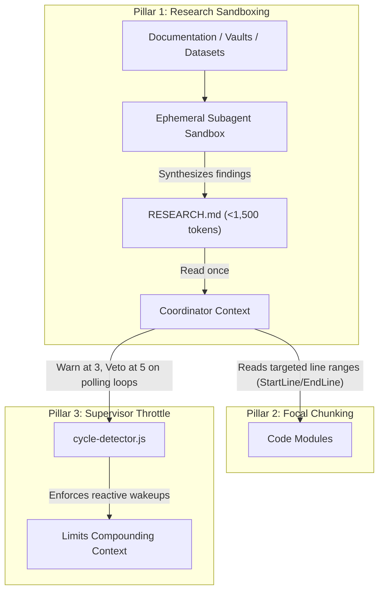

# AgentAegis (`@samarvscode/aegis`)
## Universal Cognitive Interceptor & Vetting Middleware for Autonomous Coding Agents

[Decision Engine: typesafe/jev-1.13.0](https://typesafe.ai) | [Verification: 11/11 Modules Pass](file:///C:/Users/User/Desktop/jev-mcp/test/test-dynamic-harness.js) | [Live Hooks: 100% Pass](file:///C:/Users/User/Desktop/jev-mcp/test/test-live-hooks.mjs) | [License: MIT](file:///C:/Users/User/Desktop/jev-mcp/LICENSE)

AgentAegis is an open-source lifecycle interceptor and validation middleware designed for autonomous coding environments, including Claude Code, Cursor, and Google Antigravity. It connects to developer lifecycle hooks (`PreToolUse`, `PostToolUse`, and `Stop`) to provide execution filtering, loop cycle detection, credential path screening, and automated test-suite gating before agent completion.

By decoupling lifecycle validation from the generative model synthesizing code, the harness enforces policy checks using local deterministic rules and TypeSafe AI Jev (`jev-1.13.0`) for semantic evaluations.

---

## Table of Contents
1. [The Decoupled Decider-Actuator Architecture](#the-decoupled-decider-actuator-architecture)
2. [Core Failure Modes Mitigated](#core-failure-modes-mitigated)
3. [The Three-Pillar Token Optimization Architecture](#the-three-pillar-token-optimization-architecture)
4. [Empirical Multi-Turn Case Study](#empirical-multi-turn-case-study)
5. [Granular Module Breakdown](#granular-module-breakdown)
6. [Large Codebase & 500+ MB Dataset Scalability](#large-codebase--500-mb-dataset-scalability)
7. [Installation & Multi-Engine Setup](#installation--multi-engine-setup)
8. [CLI Reference](#cli-reference)
9. [Deterministic Verification Suite](#deterministic-verification-suite)
10. [License](#license)

---

## The Decoupled Decider-Actuator Architecture

Standard autonomous agents use a single monolithic LLM for both generative coding and tactical self-governance. This architecture encounters three operational challenges:
1. **Compounding Context Growth**: Tool outputs, file reads, and status polling accumulate across turns, generating compounding wire tokens.
2. **Premature Completion Reporting**: Generative models may conclude tasks before test suites are executed or verified on disk.
3. **Repetitive Edit Cycles**: During debugging, models can oscillate between identical or near-identical modifications across turns.

AgentAegis introduces an architectural separation between code generation and execution validation:

| Responsibility | Jev System One (Cognitive Decider) | Frontier LLM (Actuator / Synthesizer) |
| :--- | :--- | :--- |
| **Model** | `jev-1.13.0` via `/v1/systemone` | Claude 3.7 Sonnet, Gemini 2.5 Pro, GPT-4o |
| **Role** | Approves tool calls, flags cycles, verifies test gates | Executes approved tools, synthesizes application code |
| **Output Type** | Structured evaluations (noul probability, score, choice) | Code diffs, syntax structures, refactors |
| **Evaluation Latency** | 200ms to 600ms per decision | 10s to 30s per generative turn |
| **Verification Basis** | Ground-truth disk state and test runner exit codes | Model reasoning and context history |
| **Execution Cost** | Local heuristics: $0.00; API calls: micro-cents | Standard model API pricing |

---

## Core Failure Modes Mitigated

### 1. Loop Thrashing and Repetitive Edits
- **Problem**: When encountering a failing test, models may cycle between two variations or repeat identical edits across multiple turns.
- **Aegis Mitigation**: `cycle-detector.js` maintains an atomic rolling session history and Levenshtein diff variance analyzer. For minor edits (<15% variance), Aegis limits repetition to 3 attempts. For larger modifications (>=15% variance), it allows up to 5 attempts. When tripped, the tool call is blocked with exit code 2.

### 2. Potentially Destructive Commands and Sensitive Paths
- **Problem**: Accidental commands (`rm -rf`, `rd /s /q`) or credential reads (`.env`, private keys) can result in data loss or credential leakage.
- **Aegis Mitigation**: `jev-client.js` and `sensitive-guard.js` inspect tool arguments and shell command strings for destructive patterns and credential targets. Regex patterns serve as an initial heuristic filter; matches are escalated to Jev System One for contextual verification. Destructive actions enforce a fail-closed policy (exit code 2) if an uncaught exception or timeout occurs. Workspace-specific patterns can be configured via `.aegis.json`.
- **Security Boundary**: AgentAegis operates as application-level lifecycle middleware. It provides defense-in-depth heuristics and semantic vetting, but does not replace kernel-level process sandboxing (such as Docker, eBPF, or seccomp). For hostile untrusted code execution, combine AgentAegis with container isolation.

### 3. Claim-to-Disk Reconciliation
- **Problem**: Agents may report files as created or modified when the filesystem state does not reflect those changes.
- **Aegis Mitigation**: `acceptance-gate.js` checks claimed file modifications against disk state and git status before allowing the agent to exit.

### 4. Premature Exit Without Test Execution
- **Problem**: Agents may complete without running the project test suite.
- **Aegis Mitigation**: On termination (`Stop` hook), `acceptance-gate.js` invokes the project test command (`npm test`, `pytest`, `cargo test`), parses stdout and stderr across supported frameworks, and vetoes exit if tests fail.

---

## The Three-Pillar Token Optimization Architecture

AgentAegis manages context growth through three architectural mechanisms:



1. **Research Sandboxing**: Multi-file documentation, datasets, or multi-query searches are delegated to an ephemeral subagent. The subagent writes a compact summary (`RESEARCH.md`, under 1,500 tokens) and exits, preventing bulk raw text from entering the main coordinator context.
2. **Focal Chunking**: Code inspections use targeted line ranges (`StartLine`/`EndLine`) or symbols rather than whole-file reads.
3. **Supervisor Throttle**: Repetitive status polling (`manage_subagents`, `manage_task`) is monitored: a warning is issued after 3 consecutive polls, and a veto is enforced after 5 polls, encouraging reliance on reactive event notifications.

---

## Empirical Multi-Turn Case Study

To observe context growth and turn counts, a standardized multi-file refactoring task was run across three configurations:
- **Baseline**: Autonomous agent execution without lifecycle interception.
- **Unconstrained Polling (V1)**: Interceptor active, supervisor polling unconstrained.
- **Sandboxed (V2)**: Research sandboxing and supervisor throttle enabled.

### Recorded Run Telemetry

| Measurement | Baseline | Unconstrained Polling (V1) | Sandboxed (V2) |
| :--- | :--- | :--- | :--- |
| **Total Wire Tokens** | 2,320,000 tokens | 6,600,000 tokens | 220,000 tokens |
| **Supervisor Turns** | 22 turns | 73 turns | 4 turns |
| **Coordinator Tokens** | 1,400,000 tokens | 5,390,000 tokens | 180,000 tokens |
| **Subagent Tokens** | 920,000 tokens | 1,230,000 tokens | 18,493 tokens |
| **Automated Tests Executed** | 0 tests | 5 tests | 11 tests |
| **Test Verification Status** | Unverified | Partial | Verified pass (exit code 0) |

*Note: Telemetry recorded during standardized evaluation runs. Actual token usage depends on task requirements and model behavior.*

---

## Granular Module Breakdown

The AgentAegis codebase is modular, zero-dependency, and written in native ES modules:

| Module | File | Responsibility |
| :--- | :--- | :--- |
| **Interceptor CLI** | `harness/interceptor.js` | Multi-engine CLI hook router (`pre-tool`, `verify-gate`). Parses raw JSON and shell key-values. Exits `0` (benign) or `2` (veto). Enforces fail-closed on uncaught errors during destructive actions. |
| **Acceptance Gate** | `harness/acceptance-gate.js` | Deterministic verification gate. Runs test runner via `safeSpawnAsync`, sanitizes custom commands against shell injection, executes claim-to-disk reconciliation audits, and verifies completion. |
| **Cycle Detector** | `harness/cycle-detector.js` | Dynamic multi-pattern loop detection (consecutive, oscillating, triangular) with diff variance and supervisor polling throttles. |
| **Sensitive Guard** | `harness/sensitive-guard.js` | Fastpath and credential exfiltration guard for file paths and shell execution arguments. Extensible via project `.aegis.json`. |
| **Diff Variance** | `harness/diff-variance.js` | Levenshtein edit distance and trivial churn classifier. Sets repetition thresholds dynamically based on code change magnitude. |
| **Runner Parser** | `harness/runner-parser.js` | Universal test runner stdout/stderr regex parser supporting Jest, Vitest, Mocha, Pytest, Cargo, Go, and TAP. |
| **Manifest Sniffer** | `harness/manifest-sniffer.js` | Workspace ecosystem sniffer (Node, Python, Rust, Go). Enforces `maxDepth = 3` and realpath symlink cycle protection. |
| **State Collector** | `harness/state-collector.js` | Gathers git status, diff stats, and stderr tails with 10MB `maxBuffer` limits. Compresses historical arguments into 8-character SHA-256 fingerprints. |
| **Invariant Linter** | `harness/core-laws-linter.js` | Universal static pattern linter enforcing safety invariants: prohibits unsafe dynamic eval, hardcoded private keys, and prototype pollution. |
| **Jev Client** | `harness/jev-client.js` | HTTP client for TypeSafe AI System One (`/v1/systemone`). Enforces dual-layer fail-closed security for destructive operations. |
| **Jev Vetter** | `harness/jev-vetter.js` | High-level semantic vetting bridge interfacing the interceptor with Jev System One. |
| **Drop-in Installer** | `harness/install.js` | Universal zero-config installer configuring Claude Code, Cursor, and Antigravity with automated timestamped backups. |

---

## Large Codebase & 500+ MB Dataset Scalability

Scalability and context protection architecture:

1. **10MB Buffer & 50-Line Line Limits**: In `harness/state-collector.js`, `execSync` is bounded by `maxBuffer: 10 * 1024 * 1024` and 50 lines. Lockfiles (`package-lock.json`, `pnpm-lock.yaml`, `poetry.lock`) are excluded automatically, preventing `ENOBUFS` crashes on monorepos.
2. **Adaptive Context Envelopes**: Diffs are bounded between 1,200 and 2,500 characters, and tool arguments over 600 characters are hashed with SHA-256 (`sha256:7f8a3c21`).
3. **Bounded Manifest Traversal**: `harness/manifest-sniffer.js` limits directory search depth to `maxDepth = 3` and tracks visited directories via `fs.realpathSync` to eliminate cyclic symlink loops.
4. **Disk-Backed Shadow Buffers**: `harness/cycle-detector.js` caches virtual file representations in `.aegis-harness/<sessionId>/shadow/` on local disk with automatic 48-hour session pruning, keeping RAM consumption under 20MB.
5. **Script-Assisted Streaming for 500+ MB Files**: Direct LLM ingestion of 500MB files is infeasible (~125M tokens). Aegis delegates large datasets (XLSX, PDF, CSV) to ephemeral subagents that query files on disk using local CPU scripts (`duckdb`, `pandas chunksize`, `ripgrep`), returning only compact summary metrics into context.

---

## Installation & Multi-Engine Setup

Install AgentAegis globally or run directly via `npx`:

```bash
# Direct installation into current project
npx @samarvscode/aegis --all

# Or specify target directory
npx @samarvscode/aegis --target-dir "/path/to/project" --all
```

### Automated Engine Configuration

AgentAegis automatically detects and non-destructively merges configuration for:

#### 1. Claude Code
Configures `.claude/settings.json`:
```json
{
  "hooks": {
    "PreToolUse": [
      {
        "matcher": ".*",
        "hooks": [{ "type": "command", "command": "node \"./harness/interceptor.js\" --engine claude pre-tool" }]
      }
    ],
    "Stop": [
      {
        "hooks": [{ "type": "command", "command": "node \"./harness/interceptor.js\" --engine claude verify-gate" }]
      }
    ]
  }
}
```

#### 2. Antigravity / Agent CLI
Configures `.agents/hooks.json`:
```json
{
  "hooks": {
    "PreToolUse": [{ "command": "node \"./harness/interceptor.js\" --engine antigravity pre-tool" }],
    "Stop": [{ "command": "node \"./harness/interceptor.js\" --engine antigravity verify-gate" }]
  }
}
```

#### 3. Cursor
Injects `.cursor/rules/jev-harness.mdc` with zero-thrashing and deterministic verification rules.

---

## CLI Reference

```bash
aegis [options]

Options:
  --target-dir <path>  Target directory to install harness (default: current working directory)
  --all                Install hooks for all detected environments (Claude, Cursor, Antigravity)
  --claude             Install Claude Code hooks (.claude/settings.json)
  --antigravity        Install Antigravity hooks (.agents/hooks.json)
  --cursor             Install Cursor rules (.cursor/rules/jev-harness.mdc)
  --dry-run            Simulate installation and output proposed changes without modifying files
  --help, -h           Display help information
```

### Environment Variables

Configure your API key in `.env`:
```bash
# TypeSafe AI Jev Endpoint Key
TYPESAFE_API_KEY=your_typesafe_api_key_here

# Optional: Custom TypeSafe Base URL (defaults to https://api.typesafe.ai/v1/systemone)
TYPESAFE_BASE_URL=https://api.typesafe.ai/v1/systemone
```

### Session Fragmentation Fix (Required for Cycle Detector)

**Problem**: `interceptor.js` derives the fallback session ID as `cwd-<hash>-p<ppid>`. `process.ppid` changes on every fresh node invocation (each Claude Code hook spawns a new node process). This produces a separate session bucket per tool call, so `cycle-detector.js` `rollingHistory` never accumulates — cycle detection is permanently blind.

**Fix**: Claude Code exposes `CLAUDE_CONVERSATION_ID` in the hook execution environment as a stable per-session identifier. The session ID priority chain in `interceptor.js` (lines 166-171) already checks `CLAUDE_CONVERSATION_ID` before the `ppid` fallback. No code change is required — simply ensure the env var is present in the hook environment.

For Claude Code, `CLAUDE_CONVERSATION_ID` is typically injected automatically. If your version does not inject it, set it manually:

```bash
# Option A: Source the helper script (also auto-maps CLAUDE_SESSION_ID if present)
source scripts/set-session-env.sh

# Option B: Set AEGIS_SESSION_ID to any stable string for your session
export AEGIS_SESSION_ID="my-project-session-1"
```

**Tradeoff** (Jev 1b verified at 0.92): Dropping `ppidSuffix` entirely (keying on `cwd-hash` alone) would re-introduce the concurrent-agent session collision that `ppidSuffix` was added to prevent. The env-export approach avoids this: each Claude session has a unique `CLAUDE_CONVERSATION_ID`, so concurrent agents in the same directory are correctly isolated.

---


## Deterministic Verification Suite

AgentAegis enforces a 100% green test policy. Run the comprehensive test suites:

```bash
# Run the 11-module dynamic harness verification suite
npm test

# Run the live multi-engine interceptor hook suite
npm run test:hooks

# Run all test suites
npm run test:all
```

---

## License

MIT License. Copyright (c) 2026 TypeSafe AI.
